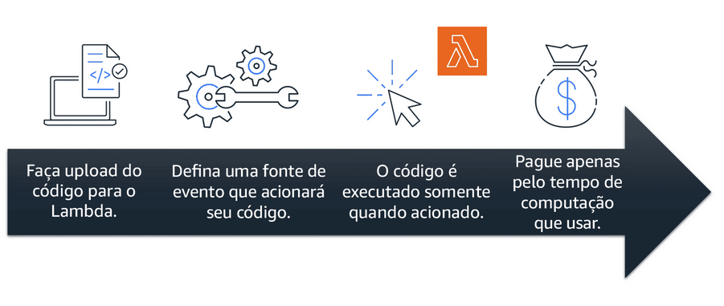

# Módulo 2
## Introdução
### Amazon Elastic Compute Cloud (Amazon EC2)
O Amazon EC2 fornece uma capacidade computacional redimensionável, o cliente escolhe quanto quer usar.
Um arquiteto responsável pelos recursos computacionais de uma empresa, sem o Amazon EC2, necessita para criar uma aplicação:
- Comprar de forma antecipada um hardware.
- Aguardar até que o hardware comprado seja entregue
- Instalar os servidores no data center
- Realizar configurações necessárias.
Já com o Amazon EC2, o mesmo arquiteto irá:
- Provisionar e executar os servidores em minutos.
- Parar de utilizar instâncias que não são mais necessárias para o app. Ou seja, não fica preso ao hardware.
- Pagar apenas pelo tempo de computação da instância que está executando.
- Economizar custo pagando somente pela capacidade necessária.
### Como Amazon EC2 funciona
### Execução
Para começar, deve-se primeiro executar uma instância. Começamos selecionando um modelo com configurações básicas (Sistema operacional, servidor de aplicativos ou os aplicativos). Podemos também selecionar uma instância específica (Configurações de Hardware). Com as configurações iniciais devemos especificar configurações de segurança para especificar o tráfego de rede que deve sair e entrar na instância.
### Conexão
Após realizarmos as configurações básicas em nossas instâncias, devemos conectar nossa aplicação ou usuários com a nuvem.
### Uso
Assim que a instância estiver conectada já é possível utilizá-la tranquilamente.
## Tipos de instância
O Amazon EC2 possui diversas instâncias distintas otimizadas para diferentes tarefas. Dentre as instâncias existentes estão
### Instâncias de uso geral
Instância equilibrada, ideal para aplicações que não exigem muito. Não possui nenhuma otimização. Exemplo:
- Servidor de apps
- Servidor de jogos
- Servidor de API's
- Bancos de dados pequenos e médios
### Otimizada para computação
Ideal para aplicações vinculadas a computação que necessitam de um processador de alto desempenho. Pode utilizar dessa instância assim como a geral.
Porém o seu uso é preferível para:
- Servidores web de alto desempenho
- Servidores de computação intensiva.
- Servidor dedicado a jogos.
- Processamento de trabalho em lote (Muitas transações em um único grupo)
### Otimizada para memória
Projetada para fornecer alto desempenho para cargas de trabalho que processam grandes conjuntos de dados na CPU. Realiza bem trabalhos com cargas que possuem alta necessidade de memória. Exemplo: Banco de dados com alta performance.
### Computação acelerada
Instâncias que utilizam aceleradores de hardware, ou como processadores, para executar tarefas de forma eficiente. Bastante utilizada para trabalhos que exigem realizar bastante cálculos.
Ideal para aplicativos gráficos e streaming de jogos e aplicativos.
### Otimizadas para armazenamento
Usada para cargas de trabalho que necessitam de um alto acesso sequencial de leitura e gravação de dados. Um exemplo de tecnologia utilizada é o Data Warehouse.
Ideal para tarefas que necessitam de um IOPS (In/Out per second) bastante alto. Essa instância é otimizada para consultas e leituras de banco de dados muito grandes.
## Precificação
### Sob demanda (0% de desconto)
Ideais para cargas de trabalho irregulares de curto prazo e que não podem ser interrompidas. Paga somente o tempo que usar a instância.
Caso de uso ideal: Realizar desenvolvimento e testes de aplicativos e executar aplicativos com padrões imprevisíveis. Ideal para curto prazo de uso.
### Saving plans (Até 72% de desconto)
É um plano com foco na economia. O cliente irá possuir um limite de uso dos recursos do Amazon EC2 com um preço X, mais barato que o normal, e assim que a sua taxa limite for excedida o preço para o uso da instância será o valor normal *Sob demanda*. Não depende da instância.
Caso de uso ideal: Quando o cliente possui um uso consistente dos recursos do EC2, mas sua aplicação não possui padrões previsíveis. Ideal para longo prazo quando se conhece o padrão de uso da aplicação.
### Instâncias reservadas (Até 75% de desconto)
O cliente reserva o uso de uma instância por um período longo de tempo e possui um desconto para o uso da mesma.
Caso de uso ideal: Cargas de trabalho de estado estacionário e uma aplicação com uso previsível.
### Instâncias Spot (Até 90% de desconto)
É ideal para tarefas que não tem tempo para acabar e tolera interrupções. As instâncias Spot utilizam a capacidade de computação que não está sendo utilizada no EC2. Porém a AWS pode recuperar o poder de processamento das instâncias ofertadas a qualquer momento e sem previsão de retorno.
Caso de uso ideal: Tarefas realizadas em segundo plano sem tempo para acabar.
### Host dedicado
Servidores físicos com capacidade de instância do Amazon EC2 dedicados ao cliente. Usado quando precisa atender um requisito muito específico do cliente. Opção mais cara ofertada.
 
## Escalabilidade e Elasticidade
 
### Amazon EC2 Auto Scaling
 
O EC2 fornece uma entrega de demanda variável para o cliente, quando o fluxo de usuários usando o serviço for muito grande a nuvem pode se adaptar para possuir demanda suficiente para todos. As instâncias aumentam ou diminuem de acordo com a necessidade.
 
#### Exemplo
 
Se o fluxo de cliente acessando o programa for muito algo isso pode causar alguns gargalos na resposta do servidor, para evitar esse problema o EC2 fornece uma forma fácil e rápida de adicionar mais instâncias. Ao adicionar novas instâncias o poder da nuvem trabalhar de forma paralela atendendo o maior número de processos possíveis, assim que o gargalo for desfeito, basta remover as instâncias que não são utilizadas.
 
## Direcionamento de tráfego
 
### Elastic Load Balance (ELB)
 
É um serviço do AWS que distribui de forma automática o tráfego de entrada de aplicativos com os recursos do EC2. O aplicativo irá se comunicar com o balanceador e o balanceador que terá a responsabilidade de adicionar ou remover instâncias de acordo com a quantidade de recursos da nuvem que está sendo demandada. O processo de balanceamento ocorre sem que seja perceptível ao usuário final.
Um exemplo seguindo a lógica da cafeteria, o balanceador de tráfego seria como o recepcionista que guia os clientes para os caixas com menor demanda, distribuindo a quantidade de trabalho entre os balconistas (Servidores).
 
## Sistema de mensagem e enfileiramento
 
### Aplicações monolíticas
Aplicações que possuem uma arquitetura altamente acoplada entre os diversos componentes. O que gera problemas como, se um componente do processo falhar, todos os outros também irão.
 
### Microsserviços
Aplicações que possuem uma arquitetura com baixo acoplamento entre os componentes. Ou seja, com essa forma arquitetural quando um componente falhar os outros que estão integrados não serão prejudicados. Na Amazon existem 2 abordagens distintas para a integração de aplicações: Amazon Simple Notification Service (Amazon SNS) e Amazon Simple Queue Service (Amazon SQS).
 
#### SNS
 
Serviço para publicação/assinatura. Serviço que pode enviar notificações, de forma instantânea, a múltiplos usuários ou de forma individual. Exemplo: Newsletters de uma plataforma no email.
 
#### SQS
 
Serviço para enfileiramento de mensagens. O SQS armazena todo tipo de dado que passar por ele, como uma fila, e envia para a próxima etapa do processo assim que possível. Dessa forma, se houver algum erro ou lentidão de comunicação entre instâncias ou componentes, o SQS irá armazenar os dados para que não sejam perdidos durante a falha.
 
## Outros serviços de computação
 
### Computação sem servidor (Server Less)
 
A Amazon fornece produtos que oferecem o benefício da computação sem servidor, o AWS Lambda. Com a computação sem servidor, você foca na qualidade de seu aplicativo sem a necessidade de se preocupar com manter o servidor.
Outro benefício da computação sem servidor é dimensionar aplicações de forma automática, a computação sem servidor ajusta a capacidade de aplicativos modificando as unidades de consumo, como a taxa de transferência de memória.
 
### AWS Lambda
 
Serviço que permite a execução de códigos sem a necessidade de utilizar servidores. Quando for necessário utilizá-lo basta enviar um aviso para o Trigger que irá iniciar a execução do código que está no AWS Lambda. As cobranças se aplicam ao tempo que o código demorou para ser executado.
 

 
### Container
 
Formas de manter toda a configuração e dependências de um código juntas em um local só o container. Dessa forma há a garantia que o ambiente que a aplicação será executada será sempre a mesma para todas as máquinas.
 
#### Amazon Elastic Container Service (Amazon ECS)
 
Sistema de gerenciamento de containers dimensionável e de alto desempenho, serve para executar e dimensionar containers. O ECS é compatível com containers Docker.
 
#### Amazon Elastic Kubernetes Service (Amazon EKS)
 
Serviço para executar Kubernetes na AWS. Gerência containers em grande escala.
 
#### Amazon Fargate
 
É um mecanismo para computação serverless para containers. Não necessita do provisionamento de servidores.
